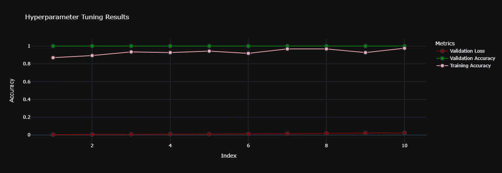

<h2 align="center">
  Leaf Classifier and Analysis
</h2>
 

 &nbsp

This project consists of two main parts: the Leaf Classifier and the Analysis of the classifier's performance.

## Leaf Classifier

The Leaf Classifier is a deep learning model that is trained to classify different types of leaves based on their features. The model uses feature scaling to normalize the features of the leaves, which helps improve the performance of the model.

The classifier is implemented in Python using the Keras library, a user-friendly neural network library written in Python. Keras makes it easy to build and train deep learning models, and it's this high-level functionality that allows us to build our leaf classifier with ease.

## Keras Tuner

The Keras Tuner is an easy-to-use, distributable hyperparameter optimization framework that solves the pain points of performing a hyperparameter search. Keras Tuner makes it easy to define the search space and leverage included algorithms for an efficient search. In this project, we use Keras Tuner to find the best hyperparameters for our model, improving the performance of our classifier.

## Analysis (analyser.ipynb)

The Analysis part of the project involves analyzing the performance of the Leaf Classifier. This is done by running a series of trials and collecting data on the performance of the classifier in each trial.

The data collected includes the validation loss, validation accuracy, and training accuracy for each trial. This data is then used to create a scatter plot that visualizes the performance of the classifier over the trials.

## How to Run

1. Open the `leaf_classifier_feature_scaling.ipynb` file in Jupyter Notebook and run all the cells to train the Leaf Classifier.

2. Open the `analyser.ipynb` file in Jupyter Notebook and run all the cells to analyze the performance of the Leaf Classifier.

## Requirements

- Python 3
- Jupyter Notebook
- Keras
- Keras Tuner

## Analysis

    

